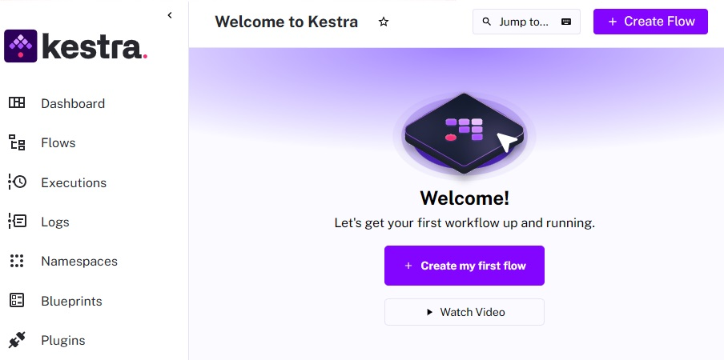
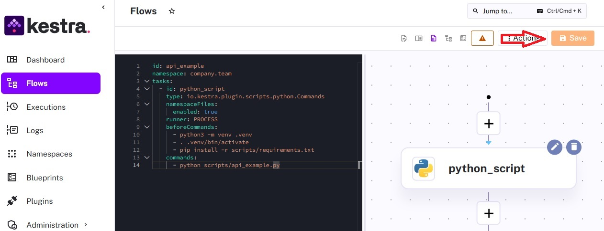
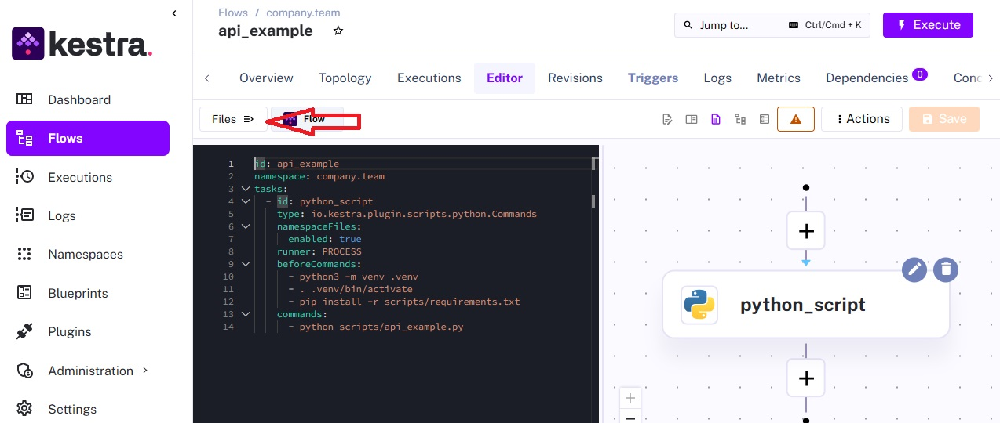
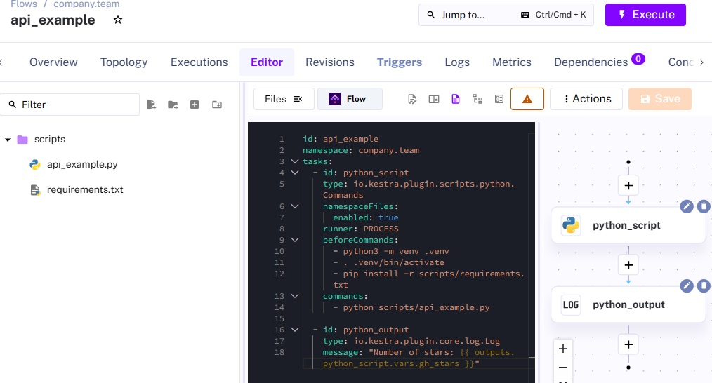
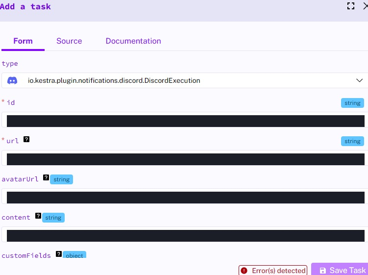
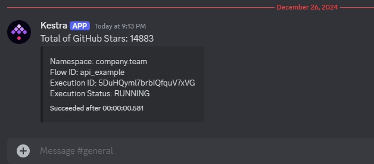
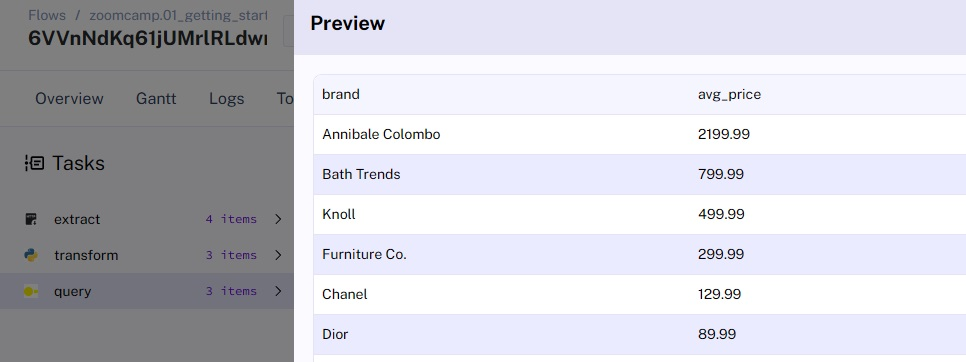
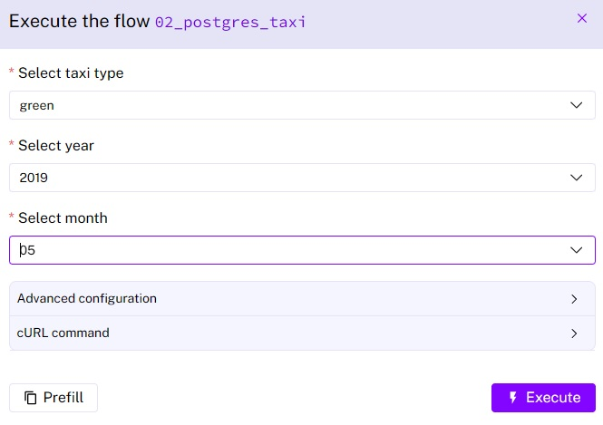
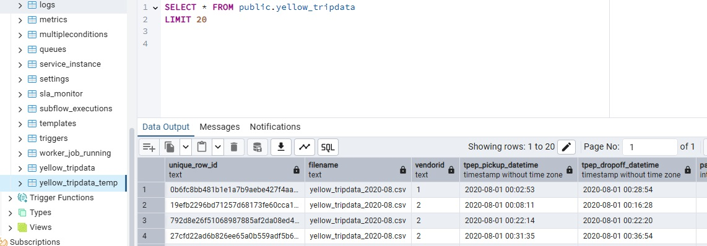

# Workflow Orchestration

- [1. Conceptual Material: Introduction to Orchestration and Kestra](#introduction-to-orchestration-and-kestra)
  - [Introduction to Workflow Orchestration](#introduction-to-workflow-orchestration)
  - [Introduction to Kestra](#introduction-to-kestra)
  - [Launch Kestra using Docker Compose](#launch-kestra-using-docker-compose)
- [2. Hands-On Coding Project: Build Data Pipelines with Kestra](#2-hands-on-coding-project-build-data-pipelines-with-kestra)
  - [Getting started pipeline](#getting-started-pipeline)
  - [Load Data to Local Postgres](#load-data-to-local-postgres)
  - [Load Data to Local Postgres with backfill](#load-data-to-local-postgres-with-backfill)
  - [Load Data to GCP](#load-data-to-gcp)


# 1. Conceptual Material: Introduction to Orchestration and Kestra

## Introduction to Workflow Orchestration

Think of an orchestrator a bit like an orchestra where an orchestra has multiple different instruments and they all need to come together in unison. Now, instead of those instruments, think of those as maybe tasks, different pipelines, microservices, etc. That's where an orchestrator comes in to tie all of those together and make sure they can work in unison. 

You probably also wondering: what's the difference between orchestration and automation? They are very similar, but orchestration is all about the bigger picture. For example, maybe you have multiple tasks running, and maybe they depend on one another. So you can make sure that certain tasks only run when other tasks are finished. If there are any errors, it can cancel other tasks, especially let you know about those as well. While automation is fantastic for scheduling singular tasks, orchestration is where you tie all of that together to make one great system.

Workflow Orchestration refers to the process of organizing, managing, and automating complex workflows, where multiple tasks or processes are coordinated to achieve a specific outcome. It involves ensuring that tasks are executed in the correct order, handling dependencies between them, and managing resources or systems involved in the workflow.


- Task Coordination: Ensuring tasks are executed in the right sequence or simultaneously, based on predefined rules or dependencies.

- Automation: Automating repetitive or complex processes to reduce manual intervention.

- Error Handling: Managing errors or failures in tasks, often with retry mechanisms or alternative execution paths.

- Resource Management: Allocating resources (e.g., computing power, APIs, or data) to tasks as needed.

- Monitoring and Reporting: Tracking the progress of workflows, identifying bottlenecks, and providing logs or reports for analysis.


Now let's discuss a few common use cases for orchestrators so you can understand when you might want to use one in your scenario.

**Data-driven environments**

Orchestrators are key for being able to allow extract, transform, and load tasks, making sure you can load them from a variety of different sources as well as load those into a data warehouse. An orchestrator can make sure that each of these steps can happen successfully. If there are any errors, it can both retry steps as well as make sure that later steps do not happen.


**CI/CD pipelines**

In CI/CD pipelines, they can be super useful for being able to build, test, and publish your code to various different places at the same time and manage all of the different steps there to make sure they happen in unison.


**Provision Resources**

If your infrastructure is cloud-based, you can use your orchestrator to help provision resources too, allowing you to just press a button, and it will set up your cloud environment for you.


## Introduction to Kestra

Kestra is an orchestration platform that’s highly flexible and well-equipped to manage all types of pipelines As an example, lets set up a simple workflow to run a Python script every hour and send the result as a Discord notification.

Run the following command to start up your instance (bash/ubuntu wsl terminal):

```
docker run --pull=always --rm -it -p 8080:8080 --user=root \
  -v /var/run/docker.sock:/var/run/docker.sock \
  -v /tmp:/tmp kestra/kestra:latest server local
```

First-time build can take up to 10 mins.

Head over to your browser and open https://localhost:8080 to launch the interface




**Properties**

Workflows are referenced as Flows and they are declared using YAML. Within each flow, there are 3 required properties you’ll need:

- id: which is the name of your flow. 

- Namespace: which allows you to specify the environments you want your flow to execute in, e.g. production vs development.

- Tasks: which is a list of the tasks that will execute when the flow is executed, in the order they’re defined in. Tasks contain an id as well as a type with each different type having their own additional properties.

**Optional Properties**

- Inputs: Instead of hardcoding values into your flows, you can set them as constant values separately. Great if you plan to reuse them in multiple tasks. 

- Outputs: Tasks will often generate outputs that you’ll want to pass on to a later task. Outputs let you connect both variables as well as files to later tasks. 

- Triggers: Instead of manually executing your flow, you can setup triggers to execute it based on a set of conditions such as time schedule or a webhook.


### Building our first flow

For our first flow, we're going to set up a simple automation that runs a Python script once every hour and sends its output as a notification. The script will make an API request to GitHub to fetch the star count of the Kestra repository and send the result to Discord.


**1: Declaring the flow**

Click on Create my first flow. Flows are declared using YAML. This YAML file describes a Kestra workflow configuration:

```yaml

id: api_example
namespace: company.team
tasks:
  - id: python_script
    type: io.kestra.plugin.scripts.python.Commands
    namespaceFiles:
      enabled: true
    runner: PROCESS
    beforeCommands:
      - python3 -m venv .venv
      - . .venv/bin/activate
      - pip install -r scripts/requirements.txt
    commands:
      - python scripts/api_example.py
```    


We will explain each part step by step:

- id: api_example. This defines the unique identifier for the workflow

- namespace: company.team. This specifies the organizational context (namespace) where the workflow resides

- Tasks: The workflow includes one task:

    1. id: python_script. The task's unique identifier
    2. type: io.kestra.plugin.scripts.python.Commands. This specifies that the task uses the Python plugin provided by Kestra to run Python scripts.
    3. namespaceFiles: enabled: true. This ensures that namespace files are available to the task. Allow our flow to see other files.
    4. runner: PROCESS. Indicates that the task will run as an independent process.
    5. beforeCommands. These commands will execute before the main script runs:

        - python3 -m venv .venv: Creates a virtual environment for Python.
        - . .venv/bin/activate: Activates the virtual environment.
        - pip install -r scripts/requirements.txt: Installs dependencies listed in the requirements.txt file.

    6. commands: The main script to execute is python scripts/api_example.py. 
    
    
For Python, you can either use a Commands or Script plugin. Commands is best for executing a separate .py file whereas Script is useful if you want to write your Python directly within the task.


Click on save button:



Then click on files in orden to create scripts folder and files:





**2: Python file**

Now you’re probably wondering, how do I get my Python file into Kestra? We can use the Editor to create this file on the platform and save it in a new folder called scripts as api_example.py


Click on create folder --> create scripts folder

Inside scripts folder create a api_example.py file with create file option.

Python code should look like this:

```python

import requests

r = requests.get('https://api.github.com/repos/kestra-io/kestra')
gh_stars = r.json()['stargazers_count']
print(gh_stars)
```

Your Kestra interface should look like this:


**3: Requirements file**

We just need to make sure we install any dependencies before the script runs. We'll need to also make a requirements.txt inside scripts folder with the requests library.


**4: Execute**

Now let’s test this by saving our flow and executing it! 


**5: Logs**


On the Logs page, we can see the output from the Python execution, including with the desired output 
at the end. It set ups the virtual environment, installs the dependencies inside of requirements.txt 
and then executes the Python script.


**6: Using Outputs**

Great, we can see that our Python script is correctly fetching the number of stars on the GitHub 
repository and outputting them to the console. However, we want to send the gh_stars variable back to our Kestra Flow so we can send a 
notification with this variable. We can adjust our Python task to generate an output which we can pass 
downstream to the next task.

Firstly, we need to add kestra to the requirements.txt

Then we’ll need to tweak our Python script to use the Kestra library to send the gh_stars 
variable to our Flow:

```python
import requests
from kestra import Kestra

r = requests.get('https://api.github.com/repos/kestra-io/kestra')
gh_stars = r.json()['stargazers_count']
Kestra.outputs({'gh_stars': gh_stars})
```

We use kestra library to assign the gh_stars variable 
to an gh_stars key in a dictionary which we’ll be able to access inside of Kestra.

With this change made, we can add an additional task that uses this variable to print it 
to the logs rather than mixed in with the full Python output. We can use the Log type and 
use the following syntax to get our output: {{ outputs.task_id.vars.output_name }}. 
As our Python task was called python_script, we can easily get our Python variable 
using {{ outputs.python_script.vars.gh_stars }} to retrieve it.

New task should look like this:

```yaml

- id: python_output
  type: io.kestra.plugin.core.log.Log
  message: "Number of stars: {{ outputs.python_script.vars.gh_stars }}"
```

And the full flow should look like this:

```yaml
id: api_example
namespace: company.team
tasks:
  - id: python_script
    type: io.kestra.plugin.scripts.python.Commands
    namespaceFiles:
      enabled: true
    runner: PROCESS
    beforeCommands:
      - python3 -m venv .venv
      - . .venv/bin/activate
      - pip install -r scripts/requirements.txt
    commands:
      - python scripts/api_example.py

  - id: python_output
    type: io.kestra.plugin.core.log.Log
    message: "Number of stars: {{ outputs.python_script.vars.gh_stars }}"   

```





Then click on save --> Click on execute

When we execute it, we should see it separated from all the Python logs for easier reading


**7: Adding a notification**

Add a task to send the output to Discord. We can do this using the topology view or YAML editor.

Lets use the topology view:


We can press the + to add a new task

We’re going to use the DiscordExecution task as this lets us push a message to a webhook which will 
send a message to a channel.

Search for DiscordExecution in type input field:



Then complete:
- id: "send_notification"
- url: "example.com" (we will edit this value later)
- content: "Number of stars: {{ outputs.python_script.vars.gh_stars }}"

Then save!


For our Discord message, we will need to give this task a Webhook URL which we can get 
from Discord. While nothing else is required, we'll change the username to be Kestra. We can also add an Avatar 
by using the URL of the GitHub Organisation profile picture.

Instead of hard coding this straight into the avatarUrl box, we can create an input:

```yaml
inputs:
  - id: kestra_logo
    type: STRING
    defaults: https://avatars.githubusercontent.com/u/59033362?v=4
```    

While we're creating inputs, we can also make our Webhook URL an input in case we want to reuse it too. 

**Create server and webhook on discord:**

create server--> Inside of server, right click and edit channel --> Integrations --> Create webhook --> copy webhook url

Now we can easily make another input underneath the kestra_logo input using the same format:


```yaml
inputs:
  - id: kestra_logo
    type: STRING
    defaults: https://avatars.githubusercontent.com/u/59033362?v=4

  - id: discord_webhook_url
    type: STRING
    defaults: https://discordapp.com/api/webhooks/1234/abcd1234
```

Change this url "https://discordapp.com/api/webhooks/1234/abcd1234" with your webhook url !

All we need to do now is reference these inputs inside of our tasks and we should be ready to run our flow:

```yaml
- id: send_notification
  type: io.kestra.plugin.notifications.discord.DiscordExecution
  url: "{{ inputs.discord_webhook_url }}"
  avatarUrl: "{{ inputs.kestra_logo }}"
  username: Kestra
  content: "Total of GitHub Stars: {{ outputs.python_script.vars.gh_stars }}"
```

Before we execute our flow, let's recap and check out the full flow:

```yaml
id: api_example
namespace: company.team

inputs:
  - id: kestra_logo
    type: STRING
    defaults: https://avatars.githubusercontent.com/u/59033362?v=4

  - id: discord_webhook_url
    type: STRING
    defaults: https://discordapp.com/api/webhooks/1234/abcd1234

tasks:
  - id: python_script
    type: io.kestra.plugin.scripts.python.Commands
    namespaceFiles:
      enabled: true
    runner: PROCESS
    beforeCommands:
      - python3 -m venv .venv
      - . .venv/bin/activate
      - pip install -r scripts/requirements.txt
    commands:
      - python scripts/api_example.py

  - id: python_output
    type: io.kestra.plugin.core.log.Log
    message: "Number of stars: {{ outputs.python_script.vars.gh_stars }}"

  - id: send_notification
    type: io.kestra.plugin.notifications.discord.DiscordExecution
    url: "{{ inputs.discord_webhook_url }}"
    avatarUrl: "{{ inputs.kestra_logo }}"
    username: Kestra
    content: "Total of GitHub Stars: {{ outputs.python_script.vars.gh_stars }}"
```    


Let’s execute this and see the log:


On discord:





**8: Setting up a Trigger**

Now that we have everything running, there's one last step we need to complete this workflow: set up a trigger 
to execute our flow automatically! For our example, we're going to use a schedule to run it once every hour.

To start with, we can use the triggers keyword underneath our tasks to specify our schedule. Similar to tasks,
 each trigger has an id and a type. For the Schedule type, we will also need to fill in a cron property so it knows what 
 schedule to use.

 We can use crontab.guru to help us figure out what the correct cron schedule expression would be to run once
  every hour.

This cron schedule expression will execute it at minute 0 of every hour:

```yaml

triggers:
  - id: hour_trigger
    type: io.kestra.plugin.core.trigger.Schedule
    cron: 0 * * * *
```

When we look at our topology view, we can now see our trigger has been correctly recognised. There's no further
 actions needed to set up the trigger, it will work as soon as you've saved your flow! But it is worth noting 
 that if you want to disable it, you can add a disabled property set to true so you don't have to delete it.


 


With that configured, we now have our fully functioning flow that can make an API request to GitHub through 
our Python script, output a value from that request to the Kestra logs as well as send it as a Discord 
notification. And on top of that, it will automatically execute once every hour! To recap, our flow should 
look like this:


```yaml

id: api_example
namespace: company.team

inputs:
  - id: kestra_logo
    type: STRING
    defaults: https://avatars.githubusercontent.com/u/59033362?v=4

  - id: discord_webhook_url
    type: STRING
    defaults: https://discordapp.com/api/webhooks/1234/abcd1234

tasks:
  - id: python_script
    type: io.kestra.plugin.scripts.python.Commands
    namespaceFiles:
      enabled: true
    runner: PROCESS
    beforeCommands:
      - python3 -m venv .venv
      - . .venv/bin/activate
      - pip install -r scripts/requirements.txt
    commands:
      - python scripts/api_example.py

  - id: python_output
    type: io.kestra.plugin.core.log.Log
    message: "Number of stars: {{ outputs.python_script.vars.gh_stars }}"

  - id: send_notification
    type: io.kestra.plugin.notifications.discord.DiscordExecution
    url: "{{ inputs.discord_webhook_url }}"
    avatarUrl: "{{ inputs.kestra_logo }}"
    username: Kestra
    content: "Total of GitHub Stars: {{ outputs.python_script.vars.gh_stars }}"

triggers:
  - id: hour_trigger
    type: io.kestra.plugin.core.trigger.Schedule
    cron: 0 * * * *
```   


## Launch Kestra using Docker Compose

When you first jump into the documentation you'll find this quick example where you can just copy and paste
 this and put it into your terminal, and this will spin up an instance of kestra:

 ```
docker run --pull=always --rm -it -p 8080:8080 --user=root \
  -v /var/run/docker.sock:/var/run/docker.sock \
  -v /tmp:/tmp kestra/kestra:latest server local
```

Now this is great for being able to spin up Kestra really quickly and get jumped in, but it makes it a little
bit tricky for being able to configure settings for kestra as well as have a persistent database. If you just
create a flow and you save that, when you restart the docker container, the flow will not be there anymore.

Not ideal long term, but great for being able to just play around with Kestra and get started.

Now we can resolve this by adding Docker Compose to spin up both a postgres database as well as a kestra server.

Lets create a docker-compose.yml file inside your 02-workflow-orchestration:

```yaml

volumes:
  postgres-data:
    driver: local
  kestra-data:
    driver: local

services:
  postgres:
    image: postgres
    volumes:
      - postgres-data:/var/lib/postgresql/data
    environment:
      POSTGRES_DB: kestra
      POSTGRES_USER: kestra
      POSTGRES_PASSWORD: kestra
    healthcheck:
      test: ["CMD-SHELL", "pg_isready -d $${POSTGRES_DB} -U $${POSTGRES_USER}"]
      interval: 30s
      timeout: 10s
      retries: 10
    ports:
      - "5433:5432"

  kestra:
    image: kestra/kestra:develop
    pull_policy: always
    user: "root"
    command: server standalone
    volumes:
      - kestra-data:/app/storage
      - /var/run/docker.sock:/var/run/docker.sock
      - /tmp/kestra-wd:/tmp/kestra-wd
    environment:
      KESTRA_CONFIGURATION: |
        datasources:
          postgres:
            url: jdbc:postgresql://postgres:5432/kestra
            driverClassName: org.postgresql.Driver
            username: kestra
            password: kestra
        kestra:
          server:
            basicAuth:
              enabled: false
              username: "admin@kestra.io" # it must be a valid email address
              password: kestra
          repository:
            type: postgres
          storage:
            type: local
            local:
              basePath: "/app/storage"
          queue:
            type: postgres
          tasks:
            tmpDir:
              path: /tmp/kestra-wd/tmp
          url: http://localhost:8080/
    ports:
      - "8080:8080"
      - "8081:8081"
    depends_on:
      postgres:
        condition: service_started


  
  pgadmin:
    image: dpage/pgadmin4
    environment:
      - PGADMIN_DEFAULT_EMAIL=admin@admin.com
      - PGADMIN_DEFAULT_PASSWORD=root
    volumes:
      - "./data_pgadmin:/var/lib/pgadmin"
    ports:
      - "8090:80"
    depends_on:
      - postgres      
```


> [!NOTE]  
I added the pgadmin service myself, it is optional but recommended to interact with the database

---

In a new terminal, go to the path where the docker-compose file is and run the following command:

```
docker-compose up -d
```

Once the container starts, you can access the Kestra UI at http://localhost:8080 and the pgadmin web 
in http://localhost:8090

To connect pgadmin with the kestra db: Right-click on Servers on the left sidebar --> Register--> Server

Under General give the Server a name: kestra taxi

Under Connection add:

- host name: postgres
- port:5432 
- user:kestra
- password:kestra


# 2. Hands-On Coding Project: Build Data Pipelines with Kestra

## Getting started pipeline

This introductory flow is added just to demonstrate a simple data pipeline which extracts data via
 HTTP REST API, transforms that data in Python and then queries it using DuckDB.

Is going to run an extract task, a transform task, and a query task:

 

### 1: Create flow
Click on Create Flow and paste the following yaml and save it:

```yaml

id: 01_getting_started_data_pipeline
namespace: zoomcamp

inputs:
  - id: columns_to_keep
    type: ARRAY
    itemType: STRING
    defaults:
      - brand
      - price

tasks:
  - id: extract
    type: io.kestra.plugin.core.http.Download
    uri: https://dummyjson.com/products

  - id: transform
    type: io.kestra.plugin.scripts.python.Script
    containerImage: python:3.11-alpine
    inputFiles:
      data.json: "{{outputs.extract.uri}}"
    outputFiles:
      - "*.json"
    env:
      COLUMNS_TO_KEEP: "{{inputs.columns_to_keep}}"
    script: |
      import json
      import os

      columns_to_keep_str = os.getenv("COLUMNS_TO_KEEP")
      columns_to_keep = json.loads(columns_to_keep_str)

      with open("data.json", "r") as file:
          data = json.load(file)

      filtered_data = [
          {column: product.get(column, "N/A") for column in columns_to_keep}
          for product in data["products"]
      ]

      with open("products.json", "w") as file:
          json.dump(filtered_data, file, indent=4)

  - id: query
    type: io.kestra.plugin.jdbc.duckdb.Query
    inputFiles:
      products.json: "{{outputs.transform.outputFiles['products.json']}}"
    sql: |
      INSTALL json;
      LOAD json;
      SELECT brand, round(avg(price), 2) as avg_price
      FROM read_json_auto('{{workingDir}}/products.json')
      GROUP BY brand
      ORDER BY avg_price DESC;
    fetchType: STORE
```    

### Step-by-step explanation of the flow:


**Id and namespace**

To begin with, here we have the ID, which is the name of our workflow. Followed by that, we have the namespace, which is sort of like a folder where we're going to store this. 

```yaml

id: 01_getting_started_data_pipeline
namespace: zoomcamp
```

**Inputs**

Following that, we have inputs, which are values we can pass in at the start of our workflow execution to then be able to define what happens. Now this one's looking for an array with two values inside of it, in this case, brand and price, which are default. But if you press execution, you can actually change what these values will be so that we can get different results for different executions.

The flow accepts a single input, an array of strings that specifies which columns to retain when processing the data:

```yaml
inputs:
  - id: columns_to_keep
    type: ARRAY
    itemType: STRING
    defaults:
      - brand
      - price
```      

**Task 1: Extract**

Afterwards, we've got our tasks, and as you can see here, the first task is going to extract data.

Downloads a JSON dataset from the URL https://dummyjson.com/products

The downloaded file's URI is accessible in subsequent tasks using {{outputs.extract.uri}}.

```yaml
tasks:
  - id: extract
    type: io.kestra.plugin.core.http.Download
    uri: https://dummyjson.com/products

```  

**Task 2: Transform**

in the Python code we're starting to transform the data to produce a new file, which is called products.json. Afterwards, we can then pass products.json to our query task


task 2:

```yaml
tasks:

  - id: transform
    type: io.kestra.plugin.scripts.python.Script
    containerImage: python:3.11-alpine
    inputFiles:
      data.json: "{{outputs.extract.uri}}"
    outputFiles:
      - "*.json"
    env:
      COLUMNS_TO_KEEP: "{{inputs.columns_to_keep}}"
    script: |
      import json
      import os

      columns_to_keep_str = os.getenv("COLUMNS_TO_KEEP")
      columns_to_keep = json.loads(columns_to_keep_str)

      with open("data.json", "r") as file:
          data = json.load(file)

      filtered_data = [
          {column: product.get(column, "N/A") for column in columns_to_keep}
          for product in data["products"]
      ]

      with open("products.json", "w") as file:
          json.dump(filtered_data, file, indent=4)
```     

- Environment: Runs a Python script in a container using the python:3.11-alpine image
- Takes the JSON file downloaded in the previous task (data.json).
- Sets COLUMNS_TO_KEEP from the input columns_to_keep
- Reads the data.json file
- Extracts only the specified columns (brand and price by default) for each product.
- Saves the transformed data to products.json.
- Outputs the filtered JSON file as products.json.


Python code is directly inside of our workflow, but we can also use Python code in separate files using the command task too as in previous example

Python script explanation:

```python
import json
import os

# Load the columns to keep from the environment variable
columns_to_keep_str = os.getenv("COLUMNS_TO_KEEP")
columns_to_keep = json.loads(columns_to_keep_str)

# Read the input JSON data
with open("data.json", "r") as file:
    data = json.load(file)

# Filter data to retain specified columns
filtered_data = [
    {column: product.get(column, "N/A") for column in columns_to_keep}
    for product in data["products"]
]

# Write the filtered data to a new JSON file
with open("products.json", "w") as file:
    json.dump(filtered_data, file, indent=4)

```


**Task 3: Query**

- Input Data: Reads the products.json file output from the transform task.
- Installs and loads DuckDB's JSON extension (INSTALL json; LOAD json;).
- Reads the products.json file and processes the data: Calculates the average price (avg_price) for 
each brand. Groups the results by brand. Orders the results in descending order of avg_price.
- fetchType: STORE: It saves the results of the SQL query to a file. This allows the results to be used by subsequent tasks in the flow


```yaml
tasks:

  - id: query
    type: io.kestra.plugin.jdbc.duckdb.Query
    inputFiles:
      products.json: "{{outputs.transform.outputFiles['products.json']}}"
    sql: |
      INSTALL json;
      LOAD json;
      SELECT brand, round(avg(price), 2) as avg_price
      FROM read_json_auto('{{workingDir}}/products.json')
      GROUP BY brand
      ORDER BY avg_price DESC;
    fetchType: STORE
```    

### 2: Execute

We get this wonderful Gantt view that helps us visualize which task has run when and at what point the workflow is at. If I click into these, it gives me some log messages


 


If you go to the outputs tab now, I will be able to view some of the data generated for the different tasks.

 


Click on preview:

 

We can see we’ve got the JSON that was extracted at the beginning. There’s a lot of data here that is not very useful to us in its current form

Then transform task also produced some data. I can see that we’ve got a JSON file here with products.json and another one called data.json. For example this is the preview from products.json:


 


Then finally, we have the query, and here is where we get a table with the data in a much more organized, sorted format. It’s much more useful to us than that original JSON value. We can then download this or pass it to another task

Tasks Query --> Outputs uri --> Preview :


 


## Load Data to Local Postgres

- CSV files accessible here: https://github.com/DataTalksClub/nyc-tlc-data/releases
- Flow code: flows/02_postgres_taxi.yaml

To keep things simple, we'll use the same database as the one we set up for Kestra in Docker Compose.


 


**Variables**

- file: The file name in the format: "{taxi}_tripdata_{year}-{month}.csv".
- table: Temporary table for the given taxi, year, and month.
- final_table: Final table storing all data for a specific taxi type.
- data: It provides the path to the file that was downloaded and decompressed during the extract task. This variable is then used in subsequent tasks, particularly when loading the data into PostgreSQL.


**Task: Set Labels**

Adds labels to the flow execution to track the selected file and taxi type.

Labels are metadata tags that help organize, identify, and track workflow executions. They can provide valuable contextual information during runtime or when reviewing logs and monitoring workflow executions.

Labels appear in the Kestra UI or logs, making it easier to understand the context of an execution. Useful for filtering or searching workflow executions by specific criteria

**Task: Extract Data**

Downloads the compressed CSV file using wget from the GitHub repository and decompresses it and saves it as a .csv file.

**Task: yellow_final_table/green_final_table**

Creates a yellow/green taxi final table in PostgreSQL if it doesn't already exist, with specific schema columns.

The reason we have to use the render function inside of this expression:

```
CREATE TABLE IF NOT EXISTS {{render(vars.final_table)}}
```

is because we need to be able to render the variable which has an expression in it so we get a string which will contain green or yellow and then we can use it otherwise we will just receive a string and it will not have the dynamic value.

When you're doing a recursive expression where you've got an expression that's calling a string that has an expression in it you just need to make sure that you explicitly tell it to render.

Schema has two extra columns: unique grow ID and file name so we can see which file the data came and a unique ID
generated based on the data in order to prevent adding duplicates later 


**Task: yellow_monthly_table/green_monthly_table**

Creates a temporary table for monthly yellow/green taxi data with schema aligned to the final_table.


**Task: truncate_table**

Ensures the monthly table is empty before loading new data.

**Task: green_copy_in/yellow_copy_in**

Loads the CSV data into the temporary table for green/yellow taxis

- runIf: "{{inputs.taxi == 'green'}}": This ensures the task runs only when the user selects green as the taxi type
- type: io.kestra.plugin.jdbc.postgresql.CopyIn: The task uses the CopyIn plugin, which supports PostgreSQL's COPY command for bulk data loading.
- from: "{{render(vars.data)}}": Refers to the data variable, which holds the path to the downloaded and decompressed CSV file. Example: green_tripdata_2019-01.csv.
- table: "{{render(vars.table)}}": Points to the dynamically created monthly table in PostgreSQL. Example: public.green_tripdata_2019_01.
- header: true: Indicates that the first row of the CSV contains column headers (e.g., VendorID, lpep_pickup_datetime, etc.).


**Task: yellow_add_unique_id_and_filename/green_add_unique_id_and_filename**

- Adds columns unique_row_id and filename if they don't exist in the temporary table
- Updates the table by generating a unique hash ID for each row and stores the file name.


**Task: yellow_merge_data/green_merge_data**

Merges monthly data from the temporary table into the yellow_final_table/green_final_table using the unique_row_id as the key

- type: io.kestra.plugin.jdbc.postgresql.Queries: Executes SQL queries on a PostgreSQL database.
- SQL Query:

  ```sql
  MERGE INTO {{render(vars.final_table)}} AS T
  USING {{render(vars.table)}} AS S
  ON T.unique_row_id = S.unique_row_id
  ```

  MERGE INTO {{render(vars.final_table)}} AS T: Combines data from the monthly table (S) into the final table (T).

  USING {{render(vars.table)}} AS S: Refers to the source table (S), which is dynamically rendered from the variable vars.table (e.g., public.yellow_tripdata_2019_01).

  ON T.unique_row_id = S.unique_row_id: Matches rows from the source (S) and target (T) based on the unique_row_id column. If a record with the same unique_row_id exists in T, it is ignored.


- SQL Query:

  ```sql
  WHEN NOT MATCHED THEN
  INSERT (
    unique_row_id, filename, VendorID, tpep_pickup_datetime, tpep_dropoff_datetime,
    passenger_count, trip_distance, RatecodeID, store_and_fwd_flag, PULocationID,
    DOLocationID, payment_type, fare_amount, extra, mta_tax, tip_amount, tolls_amount,
    improvement_surcharge, total_amount, congestion_surcharge
  )
  VALUES (
    S.unique_row_id, S.filename, S.VendorID, S.tpep_pickup_datetime, S.tpep_dropoff_datetime,
    S.passenger_count, S.trip_distance, S.RatecodeID, S.store_and_fwd_flag, S.PULocationID,
    S.DOLocationID, S.payment_type, S.fare_amount, S.extra, S.mta_tax, S.tip_amount, S.tolls_amount,
    S.improvement_surcharge, S.total_amount, S.congestion_surcharge
  );
  ```

  WHEN NOT MATCHED THEN: Ensures that only records that do not already exist in T are inserted.

  INSERT VALUES: Inserts all relevant columns from the monthly table,


**Task: purge_files**

This task ensures that any files downloaded or generated during the flow execution are deleted once they are no longer needed. Its purpose is to keep the storage clean and free of unnecessary clutter.


**Plugin Defaults**

All PostgreSQL tasks use a pre-configured connection:

URL: jdbc:postgresql://host.docker.internal:5433/kestra
Username: kestra
Password: kestra


**Execute!**

Lets try with this example:

 

Head over to pgadmin, temporary table looks like this:

 

final table looks like this:

 


## Load Data to Local Postgres with backfill

- Flow code: flows/02_postgres_taxi_scheduled.yaml

Backfill is the process of running a workflow or data pipeline for historical data that wasn't processed when it originally occurred. It involves replaying or processing past data to ensure the dataset is complete and up to date.

Now we can start using schedules and backfills to automate our pipeline. All we need here is an input for the type of taxi. Previously, we had the month and the year to go with that too. We don't need that this time because we're going to use the trigger to automatically add that.

**concurrency**

```yaml
concurrency:
    limit: 1
```

It's worth noting that we need to run these one at a time because we only have one staging table here meaning we can only run one execution of this workflow at a time to prevent multiple flows from writing different months to the same staging table. If we want to run multiple months at a time, we should create staging tables for each of the months. 


**Triggers: green_schedule**

- Cron Expression: "0 9 1 * *": Runs at 9:00 AM on the first day of every month.
-  Initiates the workflow to process monthly data for green taxis at the scheduled time.

**Triggers: yellow_schedule**

- Cron Expression: "0 10 1 * *": Runs at 10:00 AM on the first day of every month.
- Initiates the workflow to process monthly data for yellow taxis at the scheduled time.


**Execute!**

Select triggers --> Backfill executions

Lets try with this example:

 


Select executions

 

Head over to pgadmin, final table looks like this:

 


## Load Data to GCP

Now that you've learned how to build ETL pipelines locally using Postgres, we are ready to move to the cloud. In this section, we'll load the same Yellow and Green Taxi data to Google Cloud Platform (GCP) using:

- Google Cloud Storage (GCS) as a data lake
- BigQuery as a data warehouse.

**1: KV Store**

Before we start loading data to GCP, we need to include your service account, GCP project ID, BigQuery dataset and GCS bucket name (along with their location) as KV Store values.

In Kestra, a KV Store (Key-Value Store) is a storage system used to persist data as key-value pairs making it ideal for storing and retrieving data efficiently during workflows. Data is stored in pairs, where:

- Key: Acts as a unique identifier.
- Value: Contains the data associated with the key.

KV Store its a great way for being able to store data that doesn't change very often but you want to access it between a number of different flows.

Adjust the following flow [`04_gcp_kv.yaml`](flows/04_gcp_kv.yaml), then execute it in kestra in order to include your service account, GCP project ID, BigQuery dataset and GCS bucket name as KV Store values.


> [!WARNING]  
> The `GCP_CREDS` service account contains sensitive information. Ensure you keep it secure and do not commit it to Git. Keep it as secure as your passwords.

---
> [!NOTE]  
>Make sure the location of your resources in GCP matches the location of the flow
>
>  ```yaml
>    - id: gcp_location
>    type: io.kestra.plugin.core.kv.Set
>    key: GCP_LOCATION
>    kvType: STRING
>    value: US
>  ```  

---


After the execution of 04_gcp_kv, go to Namespaces --> KV Store

Should look like this:

 


**2: Execute flow**

Lets try [`06_gcp_taxi.yaml`](flows/06_gcp_taxi.yaml) with inputs green, year 2019 and month 07.

If the flow was executed correctly, the Gantt chart should look like this:

 

<br>
Your bucket should look like this:

 
<br>
And BigQuery should look like this:

 
<br>