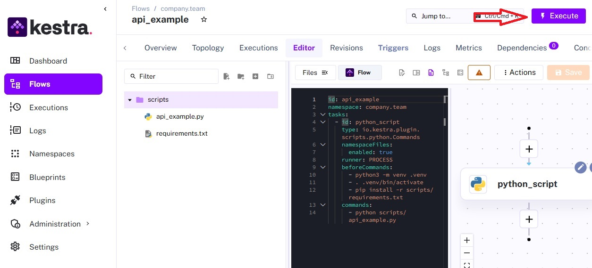
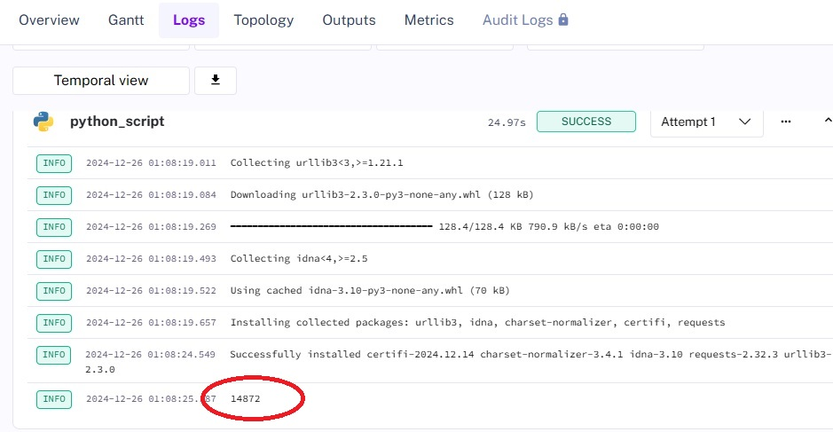

# Workflow Orchestration


## Introduction to Workflow Orchestration

Think of an orchestrator a bit like an orchestra where an orchestra has multiple different instruments and they all need to come together in unison. Now, instead of those instruments, think of those as maybe tasks, different pipelines, microservices, etc. That's where an orchestrator comes in to tie all of those together and make sure they can work in unison. 

You probably also wondering: what's the difference between orchestration and automation? They are very similar, but orchestration is all about the bigger picture. For example, maybe you have multiple tasks running, and maybe they depend on one another. So you can make sure that certain tasks only run when other tasks are finished. If there are any errors, it can cancel other tasks, especially let you know about those as well. While automation is fantastic for scheduling singular tasks, orchestration is where you tie all of that together to make one great system.

Now let's discuss a few common use cases for orchestrators so you can understand when you might want to use one in your scenario.

**Data-driven environments**

Orchestrators are key for being able to allow extract, transform, and load tasks, making sure you can load them from a variety of different sources as well as load those into a data warehouse. An orchestrator can make sure that each of these steps can happen successfully. If there are any errors, it can both retry steps as well as make sure that later steps do not happen.


**CI/CD pipelines**

In CI/CD pipelines, they can be super useful for being able to build, test, and publish your code to various different places at the same time and manage all of the different steps there to make sure they happen in unison.


**Provision Resources**

If your infrastructure is cloud-based, you can use your orchestrator to help provision resources too, allowing you to just press a button, and it will set up your cloud environment for you.


## Introduction to Kestra

Kestra is an orchestration platform that’s highly flexible and well-equipped to manage all types of pipelines As an example, lets set up a simple workflow to run a Python script every hour and send the result as a Discord notification.

Run the following command to start up your instance:

```
docker run --pull=always --rm -it -p 8080:8080 --user=root \
  -v /var/run/docker.sock:/var/run/docker.sock \
  -v /tmp:/tmp kestra/kestra:latest server local
```

First-time build can take up to 10 mins.

Head over to your browser and open https://localhost:8080 to launch the interface


**Properties**

Workflows are referenced as Flows and they are declared using YAML. Within each flow, there are 3 required properties you’ll need:

- id: which is the name of your flow. 

- Namespace: which allows you to specify the environments you want your flow to execute in, e.g. production vs development.

- Tasks: which is a list of the tasks that will execute when the flow is executed, in the order they’re defined in. Tasks contain an id as well as a type with each different type having their own additional properties.

**Optional Properties**

- Inputs: Instead of hardcoding values into your flows, you can set them as constant values separately. Great if you plan to reuse them in multiple tasks. 

- Outputs: Tasks will often generate outputs that you’ll want to pass on to a later task. Outputs let you connect both variables as well as files to later tasks. 

- Triggers: Instead of manually executing your flow, you can setup triggers to execute it based on a set of conditions such as time schedule or a webhook.


### Building our first flow

For our first flow, we're going to set up a simple automation that runs a Python script once every hour and sends its output as a notification. The script will make an API request to GitHub to fetch the star count of the Kestra repository and send the result to Discord.


**1: Declaring the flow**

Click on Create my first flow. Flows are declared using YAML. This YAML file describes a Kestra workflow configuration:

```yaml

id: api_example
namespace: company.team
tasks:
  - id: python_script
    type: io.kestra.plugin.scripts.python.Commands
    namespaceFiles:
      enabled: true
    runner: PROCESS
    beforeCommands:
      - python3 -m venv .venv
      - . .venv/bin/activate
      - pip install -r scripts/requirements.txt
    commands:
      - python scripts/api_example.py
```    

Then click on save.

We will explain each part step by step:

- id: api_example. This defines the unique identifier for the workflow

- namespace: company.team. This specifies the organizational context (namespace) where the workflow resides

- Tasks: The workflow includes one task:

    1. id: python_script. The task's unique identifier
    2. type: io.kestra.plugin.scripts.python.Commands. This specifies that the task uses the Python plugin provided by Kestra to run Python scripts.
    3. namespaceFiles: enabled: true. This ensures that namespace files are available to the task. Allow our flow to see other files.
    4. runner: PROCESS. Indicates that the task will run as an independent process.
    5. beforeCommands. These commands will execute before the main script runs:

        - python3 -m venv .venv: Creates a virtual environment for Python.
        - . .venv/bin/activate: Activates the virtual environment.
        - pip install -r scripts/requirements.txt: Installs dependencies listed in the requirements.txt file.

    6. commands: The main script to execute is python scripts/api_example.py. 
    
    
For Python, you can either use a Commands or Script plugin. Commands is best for executing a separate .py file whereas Script is useful if you want to write your Python directly within the task.


**2: Python file**

Now you’re probably wondering, how do I get my Python file into Kestra? We can use the Editor to create this file on the platform and save it in a new folder called scripts as api_example.py


Click on create folder --> create scripts folder

Inside scripts folder create a api_example.py file with create file option.

Python code should look like this:

```python

import requests

r = requests.get('https://api.github.com/repos/kestra-io/kestra')
gh_stars = r.json()['stargazers_count']
print(gh_stars)
```


**3: Requirements file**

We just need to make sure we install any dependencies before the script runs. We'll need to also make a requirements.txt inside scripts folder with the requests library.


**4: Execute**

Now let’s test this by saving our flow and executing it! 





**5: Logs**


On the Logs page, we can see the output from the Python execution, including with the desired output at the end. It set ups the virtual environment, installs the dependencies inside of requirements.txt and then executes the Python script.





