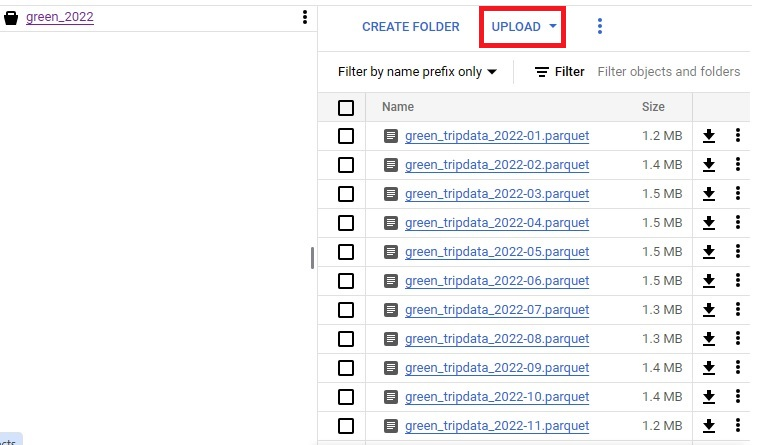
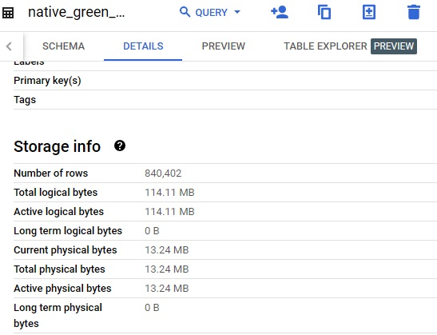

# Module 3 Homework

## Inserting data with airflow:

To see how to insert data to GCS every month and build the 2022 table in Big Query using airflow, see here:

https://github.com/ManuelGuerra1987/data-engineering-zoomcamp-notes/tree/main/2_Workflow-Orchestration-(AirFlow)#ingesting-data-to-gcp-multiple-months

## Inserting data manually:

1: Create a green_2022 bucket in Google Cloud Storage

2: Upload parquet files to the bucket:



3: Create external table for whole 2022

Run this query in Big Query:

```sql

CREATE OR REPLACE EXTERNAL TABLE zoomcamp-airflow-444903.airflow2025.external_green_2022
OPTIONS(
  FORMAT='PARQUET',
  URIS=['gs://green_2022/*']
)

```

4: Create native table for whole 2022

```sql

CREATE OR REPLACE TABLE zoomcamp-airflow-444903.airflow2025.native_green_2022
AS(
  SELECT * FROM `zoomcamp-airflow-444903.airflow2025.external_green_2022`
)

```


## Question 1:

What is count of records for the 2022 Green Taxi Data??

```sql

SELECT count(1) FROM `zoomcamp-airflow-444903.airflow2025.green_2022` ;

```

Answer: 840402


## Question 2:

Write a query to count the distinct number of PULocationIDs for the entire dataset on both the tables.
What is the estimated amount of data that will be read when this query is executed on the External Table and the Table?

Type this query:

```sql

 SELECT COUNT(DISTINCT PULocationID)

 FROM `zoomcamp-airflow-444903.airflow2025.external_green_2022`
 ```

You should see for the external table:

 

You should see for the native table:

 

 0 MB for the External Table and 6.41MB for the native Table

 ## Question 3:

How many records have a fare_amount of 0?

 ```sql

  SELECT COUNT(1)

 FROM `zoomcamp-airflow-444903.airflow2025.native_green_2022`

 WHERE fare_amount = 0;
 ```

 Answer: 1622


## Question 4:

What is the best strategy to make an optimized table in Big Query if your query will always order the results by PUlocationID and filter based on lpep_pickup_datetime? (Create a new table with this strategy)

- Cluster on lpep_pickup_datetime Partition by PUlocationID
- Partition by lpep_pickup_datetime Cluster on PUlocationID
- Partition by lpep_pickup_datetime and Partition by PUlocationID
- Cluster on by lpep_pickup_datetime and Cluster on PUlocationID


When you see "filter," that's going to be where you can reduce the data you read. When you think of a "WHERE" clause, think of it as a way to read less data. What helps us read less data are partitions, where you divide the data into smaller chunks so that less has to be read. When you hear "order," that's more about clustering the data in the order in which it's stored. For this case, it makes sense to partition by the pickup date and time and cluster by the pickup location ID.

Creating the partitioned table:

```sql

CREATE OR REPLACE TABLE zoomcamp-airflow-444903.airflow2025.partitioned_green_2022
PARTITION BY DATE(lpep_pickup_datetime)
CLUSTER BY PUlocationID
AS(
  SELECT * FROM `zoomcamp-airflow-444903.airflow2025.native_green_2022`
)
```


## Question 5:

Write a query to retrieve the distinct PULocationID between lpep_pickup_datetime 06/01/2022 and 06/30/2022 (inclusive)

Use the materialized table you created earlier in your from clause and note the estimated bytes. Now change the table in the from clause to the partitioned table you created for question 4 and note the estimated bytes processed. What are these values?

```sql

SELECT DISTINCT PULocationID
FROM `zoomcamp-airflow-444903.airflow2025.partitioned_green_2022`

WHERE lpep_pickup_datetime >= '2022-06-01'
AND lpep_pickup_datetime <= '2022-06-30'

```

You should see for the native table:

 

 You should see for the partitioned table:

 


## Question 6:

Where is the data stored in the External Table you created?

If you created an external table in BigQuery, for example, the data would be stored in a specified location, such as a Google Cloud Storage bucket, and BigQuery would query this data when needed.


## Question 7:

Clustering is less effective for small datasets (e.g., under 1 GB), where partitioning or clustering adds metadata overhead and costs. So the answer to question seven is false.


## Question 8: (Bonus: Not worth points)

No Points: Write a SELECT count(*) query FROM the materialized table you created. How many bytes does it estimate will be read? Why?

```sql

SELECT count(1)
FROM `zoomcamp-airflow-444903.airflow2025.native_green_2022`;
```

You should see:


it's not going to read any bytes when it counts the number of rows. If you go down here to the native table and just open that up, it makes sense. If you scroll down here, the number of rows is known because it's stored in BigQuery how many rows it has. So if you just select count star, it's not really going to read the data, it's going to look at its metadata.

 


