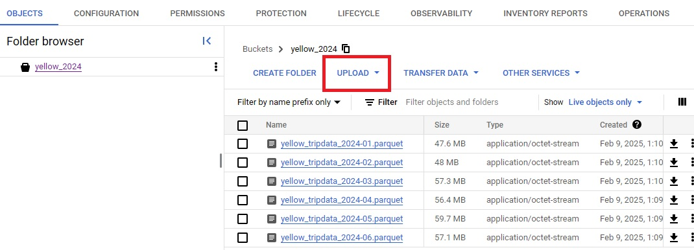

# Module 3 Homework

For this homework we will be using the Yellow Taxi Trip Records for January 2024 - June 2024 Parquet Files from the New York City Taxi Data found here:

https://www.nyc.gov/site/tlc/about/tlc-trip-record-data.page

## Inserting data manually:

1: Create a yellow_2024 bucket in Google Cloud Storage

2: Upload parquet files to the bucket:

<br>



<br>

3: Create external table 

Run this query in Big Query:

```sql

CREATE OR REPLACE EXTERNAL TABLE zoomcamp-airflow-444903.homework2025.external_yellow_2024
OPTIONS(
  FORMAT='PARQUET',
  URIS=['gs://yellow_2024/*']
)

```

<br>


<br>

4: Create native table 

```sql

CREATE OR REPLACE TABLE zoomcamp-airflow-444903.homework2025.native_yellow_2024
AS(
  SELECT * FROM `zoomcamp-airflow-444903.homework2025.external_yellow_2024`
)

```

## Question 1:

What is count of records for the 2024 Yellow Taxi Data?

```sql

SELECT count(1) FROM `zoomcamp-airflow-444903.homework2025.native_yellow_2024` ;

```

Answer: 20,332,093


## Question 2:

Write a query to count the distinct number of PULocationIDs for the entire dataset on both the tables.
What is the estimated amount of data that will be read when this query is executed on the External Table and the Table?

Native table:

<br>


<br>

External table:

<br>


<br>

Answer: 0 MB for the External Table and 155.12 MB for the Materialized Table


## Question 3:

Write a query to retrieve the PULocationID from the table (not the external table) in BigQuery. Now write a query to retrieve the PULocationID and DOLocationID on the same table. Why are the estimated number of Bytes different?

<br>


<br>

BigQuery is a columnar database, and it only scans the specific columns requested in the query. Querying two columns (PULocationID, DOLocationID) requires reading more data than querying one column (PULocationID), leading to a higher estimated number of bytes processed.

## Question 4:

How many records have a fare_amount of 0?

```sql

SELECT COUNT(fare_amount)  FROM `zoomcamp-airflow-444903.homework2025.native_yellow_2024`
WHERE fare_amount = 0 ;
```

Answer: 8333

## Question 5:

What is the best strategy to make an optimized table in Big Query if your query will always filter based on tpep_dropoff_datetime and order the results by VendorID (Create a new table with this strategy)

Answer:  Partition by tpep_dropoff_datetime and Cluster on VendorID

When you see "filter," that's going to be where you can reduce the data you read. What helps us read less data are partitions, where you divide the data into smaller chunks so that less has to be read. When you hear "order," that's more about clustering the data in the order in which it's stored. For this case, it makes sense to partition by the dropoff_datetime and cluster by the VendorID

```
CREATE OR REPLACE TABLE zoomcamp-airflow-444903.homework2025.partitioned_yellow_2024
PARTITION BY DATE(tpep_dropoff_datetime)
CLUSTER BY VendorID
AS(
  SELECT * FROM `zoomcamp-airflow-444903.homework2025.native_yellow_2024`
)
```

## Question 6:

Write a query to retrieve the distinct VendorIDs between tpep_dropoff_datetime 2024-03-01 and 2024-03-15 (inclusive)

Use the materialized table you created earlier in your from clause and note the estimated bytes. Now change the table in the from clause to the partitioned table you created for question 5 and note the estimated bytes processed. What are these values?

<br>


<br>

310.24 MB for non-partitioned table and 26.84 MB for the partitioned table

## Question 7:

Where is the data stored in the External Table you created?

GCP Bucket

## Question 8:

It is best practice in Big Query to always cluster your data:

False


- While clustering can improve query performance and reduce costs by organizing data based on specified columns, it is not always the best practice in every scenario. If queries often filter or aggregate data based on certain columns, clustering those columns can help.

- Clustering is most beneficial for large tables. For smaller tables, the performance gains may be negligible.

- Clustering can increase storage costs due to additional metadata and reorganization overhead.